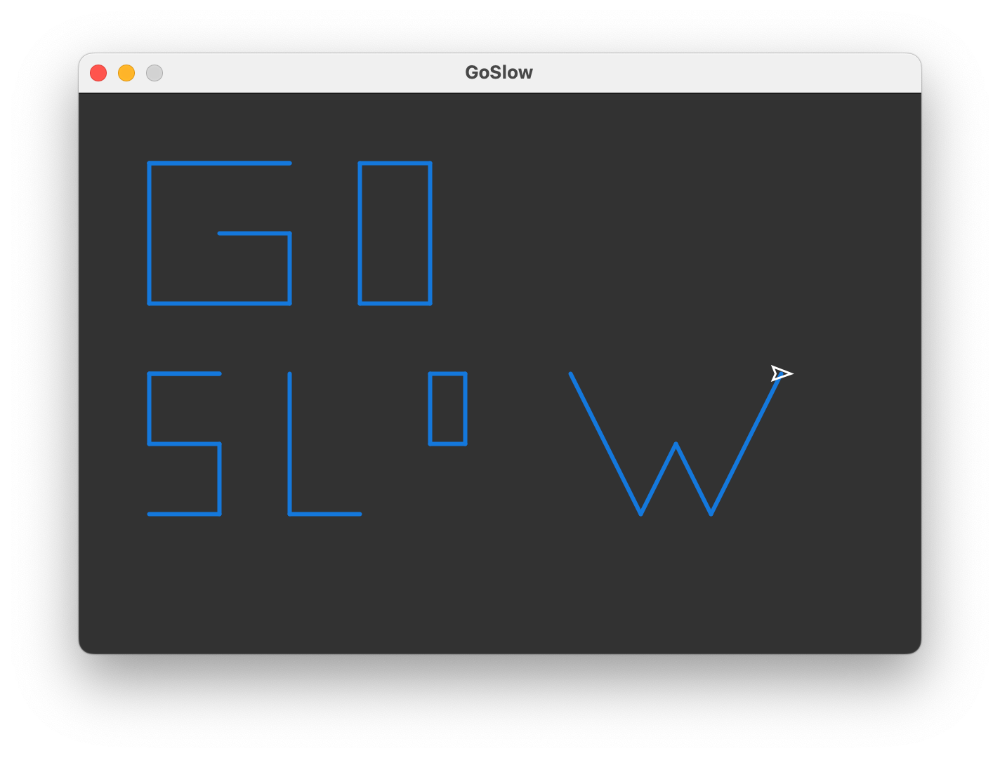
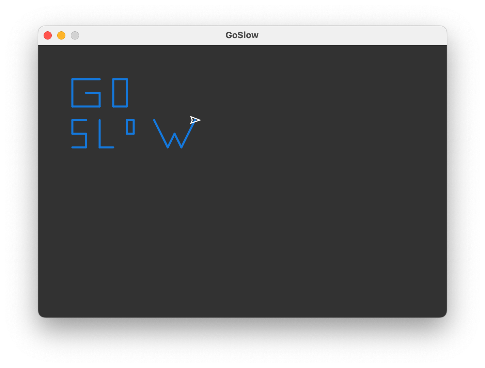

# Go Slow

This assignment uses the Processing application to draw stuff with a `Turtle`. You will code in Java, but it's a little simpler than a true Java program. There is no `public static void main(String[] args)` and you can call some methods without a reference to a class.

To see all the methods that you can use with the Turtle object, read the API.md file included in this repository.

Your mission is to draw the following message:

Your code should use methods for each letter, and probably reuse any letters that you see twice. It should be easy to change one value in your code and get something like this:

You do not need to produce this exactly (letter shapes and colors are up to you) but it needs to be able to be scaled by changing one variable in the code.

## Turtle Class
The Turtle class is in the `Turtle.pde` file. You should probably not modify this file!

## GoSlow.pde
This is the file you should code in.